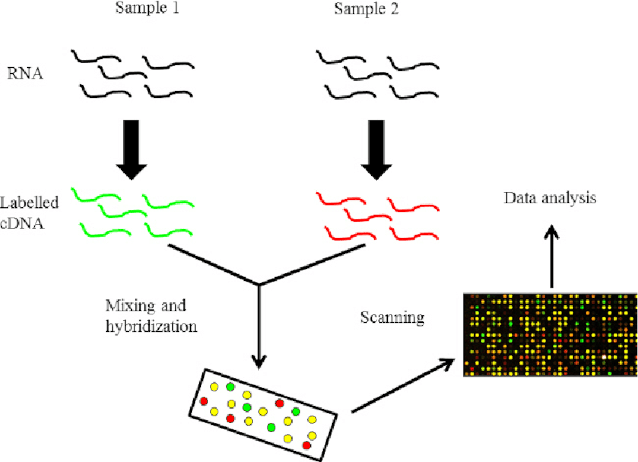
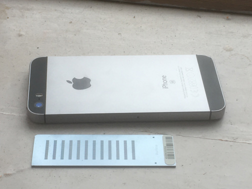

```{r setup, include=FALSE}
knitr::opts_chunk$set(echo = FALSE)
library(ggthemr)
uos_pal <- function(){
  uos_pal <- c("Process_Cyan"=rgb(0,159,218,maxColorValue = 255),
               "Pantone_274"=rgb(31,20,93,maxColorValue = 255),
               "Process_Yellow"=rgb(249,227,0,maxColorValue = 255),
               
               "Pantone_347"=rgb(0,155,72,maxColorValue = 255),
               "Pantone_382"=rgb(190,214,0,maxColorValue = 255),
               "Process_Magenta"=rgb(209,0,116,maxColorValue = 255),
               "Pantone_Orange_021"=rgb(255,88,0,maxColorValue = 255),
               
               "Pantone_512"=rgb(119,33,111,maxColorValue = 255),
               "Pantone_485"=rgb(213,43,30,maxColorValue = 255),
               "Pantone_Black"=rgb(30,30,30,maxColorValue = 255),
               "Pantone_161"=rgb(98,60,27,maxColorValue = 255),
               
               "Pantone_7501"=rgb(219,206,172,maxColorValue = 255),
               "Pantone_343"=rgb(3,86,66,maxColorValue = 255),
               "Pantone_322"=rgb(0,116,122,maxColorValue = 255),
               "Pantone_202"=rgb(130,36,51,maxColorValue = 255)
  )
  
  uos_pal
}

uos_colours <- as.character(uos_pal())
# you have to add a colour at the start of your palette for outlining boxes, we'll use a grey:
uos_colours <- c("#555555", uos_colours)
# remove previous effects:

ggthemr_reset()
# Define colours for your figures with define_palette
uos <- define_palette(
  swatch = uos_colours, # colours for plotting points and bars
  gradient = c(lower = uos_colours[1L], upper = uos_colours[2L]), #upper and lower colours for continuous colours
  background = "white" #defining a grey-ish background 
)
# set the theme for your figures:
ggthemr(uos)
```

## Week 1 recap

- Value of reproducibility
- Review of Rstudio and some tidyverse packages

## Week 2 Overview

- Overview of analysing biological data
  + example dataset from older technology
- Define some key steps

## The technology


(image uploaded to researchgate by Muhammad Afzal)

## The technology



- Illumina HT-12 chip
- 12 samples; 48,000 probes

## Microarrays vs RNA-seq

- Require DNA sequences (probes) to be designed ahead of time
- The probes could be incorrectly designed
  + the genome changes over time; the probes do not
  + ~50% might not actually target the correct regions!
- Don't permit novel discoveries
- Difficult to detect lowly-expressed transcripts

## Microarrays vs RNA-seq

- RNA-seq permits whole transcriptome to be profiled
- Data can be re-analysed with different genome versions (future-proof)
- Costs initially prohibitively higher, but have reduced dramatically
- Much larger volume of data (initially) but comparable once pre-processed (aligned)
- New computational methods were required, but these are established now
- Many key principles apply
  + experimental design
  + quality assessment
  + statistical testing

## Data availability

- Vast amount of data available in public *repositories*
    + Gene Expression Omnibus (GEO)
    + ArrayExpress
- Relatively quick and easy to validate hypotheses
- 

## Multi-dimensional data

- Once downloaded the data are not in a straightforward form that we are used to
- Separate data frames
  + expression measurements (the *assay* data)
  + sample annotation (the *meta* data)
  + feature annotation
- Hence the need for specialised packages

## Multi-dimensional data

Say we have interrogated **10,000** genes for **10** patients

- the expression matrix will have **10,000** rows and **10** columns
- the sample annotation will have **10** rows and arbitrary number of columns
  + age of patient, gender, disease state
  + experiment batch, date collected
- the feature annotation will have **10,000** rows and arbitrary number of columns
  + probe identifier
  + common gene name, ensembl name, genome position

## Workflow overview

- quality assessment
  + did the experiment work? any batch effects
- normalisation
  + adjust for technical variation
- statistical testing
  + which genes have evidence for change between groups

## Quality assessment

+ samples should exhibit roughly the same *distribution* of intensities
+ any difference between sample run on different *batches*?
+ any *outliers*?
- Assessed by a boxplot (among other methods)

```{r echo=FALSE,message=FALSE,warning=FALSE, fig.height=2.5}
suppressPackageStartupMessages(library(dplyr))
suppressPackageStartupMessages(library(ggplot2))
if(!require(MAQCsubsetILM)) BiocManager::install("MAQCsubsetILM")
suppressPackageStartupMessages(library(MAQCsubsetILM))
data(refA)
data(refB)
data(refC)
gse <- lumi::combine(refA,refB,refC)
sampleinfo <- pData(gse)

log2(exprs(gse)) %>% 
  data.frame %>% 
  tibble::rownames_to_column("Probe") %>% 
  tidyr::pivot_longer(names_to = "sampleID",values_to="Intensity",-Probe) %>% 
  left_join(sampleinfo) %>% 
  mutate(batch = paste0("Batch",as.factor(site)), Group=ref) %>% 
  ggplot(aes(x = Group, y = Intensity,fill=Group)) + geom_boxplot(outlier.shape = NA ) + facet_wrap(~batch) + ylim(5,8)

```


## Normalisation

- correct for technical and non-interesting variation between samples
- tend to assume that **most genes don't change** between samples
- assume that distribution is highly-similar
  + quantile normalisation forces distributions to be identical

```{r echo=FALSE,message=FALSE,warning=FALSE, fig.height=2.5}
limma::normalizeQuantiles(log2(exprs(gse))) %>% 
  data.frame %>% 
  tibble::rownames_to_column("Probe") %>% 
  tidyr::pivot_longer(names_to = "sampleID",values_to="Intensity",-Probe) %>% 
  left_join(sampleinfo) %>% 
  mutate(batch = paste0("Batch",as.factor(site)), Group=ref) %>% 
  ggplot(aes(x = Group, y = Intensity,fill=Group)) + geom_boxplot(outlier.shape = NA ) + facet_wrap(~batch) + ylim(5,8)
```

## Statistical Testing

- which genes show evidence for different expression between sample groups
- large number of genes, generally few samples
- make assumptions about data distribution
  + assume *normal* so can use a t-statistic
- need to correct for *multiple testing*

```{r echo=FALSE,message=FALSE,warning=FALSE, fig.height=2.5}
limma::normalizeQuantiles(log2(exprs(gse))) %>% 
  data.frame %>% 
  tibble::rownames_to_column("Probe") %>% 
  tidyr::pivot_longer(names_to = "sampleID",values_to="Intensity",-Probe) %>% 
  left_join(sampleinfo) %>% 
  filter(Probe == "GI_10047089-S",ref %in% c("A","B")) %>% 
  ggplot(aes(x = ref, y = Intensity,fill=ref)) + geom_boxplot(alpha=0.4) + geom_jitter(width=0.1,col="black")
```


## Further viewing

- [Gene Expression Analysis and DNA microarray Assays](https://youtu.be/Hv5flUOsE0s) - 8 minutes
- [Quantile Normalisation for high-throughput Biology](https://youtu.be/ecjN6Xpv6SE) - 5 minutes
- [Statistics for Genomics](https://youtu.be/3huF0DwxCtU) - 30 minutes
- [Multiple Testing Correction](https://youtu.be/K8LQSvtjcEo) - 18 minutes


