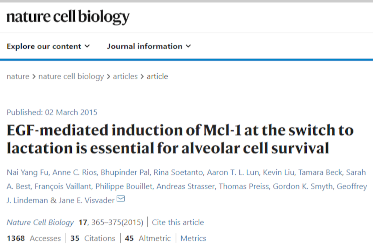

```{r setup, include=FALSE}
knitr::opts_chunk$set(echo = FALSE)
knitr::opts_chunk$set(echo = FALSE)
library(ggthemr)
uos_pal <- function(){
  uos_pal <- c("Process_Cyan"=rgb(0,159,218,maxColorValue = 255),
               "Pantone_274"=rgb(31,20,93,maxColorValue = 255),
               "Process_Yellow"=rgb(249,227,0,maxColorValue = 255),
               
               "Pantone_347"=rgb(0,155,72,maxColorValue = 255),
               "Pantone_382"=rgb(190,214,0,maxColorValue = 255),
               "Process_Magenta"=rgb(209,0,116,maxColorValue = 255),
               "Pantone_Orange_021"=rgb(255,88,0,maxColorValue = 255),
               
               "Pantone_512"=rgb(119,33,111,maxColorValue = 255),
               "Pantone_485"=rgb(213,43,30,maxColorValue = 255),
               "Pantone_Black"=rgb(30,30,30,maxColorValue = 255),
               "Pantone_161"=rgb(98,60,27,maxColorValue = 255),
               
               "Pantone_7501"=rgb(219,206,172,maxColorValue = 255),
               "Pantone_343"=rgb(3,86,66,maxColorValue = 255),
               "Pantone_322"=rgb(0,116,122,maxColorValue = 255),
               "Pantone_202"=rgb(130,36,51,maxColorValue = 255)
  )
  
  uos_pal
}

uos_colours <- as.character(uos_pal())
# you have to add a colour at the start of your palette for outlining boxes, we'll use a grey:
uos_colours <- c("#555555", uos_colours)
# remove previous effects:

ggthemr_reset()
# Define colours for your figures with define_palette
uos <- define_palette(
  swatch = uos_colours, # colours for plotting points and bars
  gradient = c(lower = uos_colours[1L], upper = uos_colours[2L]), #upper and lower colours for continuous colours
  background = "white" #defining a grey-ish background 
)
# set the theme for your figures:
ggthemr(uos)
suppressPackageStartupMessages(library(dplyr))
suppressPackageStartupMessages(library(ggplot2))
suppressPackageStartupMessages(library(DESeq2))
```


## Week 2 recap

- Introduction to analysis of high-throughput biological data in Bioconductor
- First look at quality assessment and normalisation
- Performed a statistical analysis

## Week 3 Overview

- Introduce of main dataset for the workshop
- Start to investigate the *raw* counts
- Perform some QA

## The dataset



- counts available at GEO; GSE60450
- raw fastq available at Sequencing Read Archive (SRA)

## Data format

- counts that have been created with *salmon*
  + counting and aligning outside the scope
- one count file for each sample
  + a raw count for each transcript
- we will import the counts into R

## The DESeq2 package

- along with `edgeR` one of the most popular packages for RNA-seq analysis in R
- extensive user-guide and tutorials online
- convenient visualisation and analysis workflows
- able to accept *count matrices* generated by multiple methods


## Quality assessment

- first task is to assess if we have enough sequencing
  + roughly 10-15 million reads
- check for any outliers and batches
- can sum the number of reads for each sample
- use boxplots as for microarrays

## Data Transformation

- RNA-seq data are *count-based* so whole numbers only
- Each row and column combination is the number of times that gene was sequenced in a particular sample
- But the counts are subject to some technical variation
  + we will look at this later
  
```{r echo=FALSE,message=FALSE,warning=FALSE}
dds <- makeExampleDESeqDataSet()
head(counts(dds))[,1:4]
```

## Data Transformation

- many genes are lowly-expressed
- some genes are extremely highly-expressed and highly-variable
  + property known as *heteroskedasticity*
- visualisation is difficult on raw scale


```{r echo=FALSE,message=FALSE,warning=FALSE, fig.height=2.5}
counts(dds) %>%   
data.frame %>% 
  tibble::rownames_to_column("Gene") %>% 
  tidyr::pivot_longer(-Gene) %>% 
  ggplot(aes(x = name, y = value)) + geom_boxplot() + theme(axis.text.x =  element_text(angle=90))
  
```


## Data Transformation

- for data visualisation and quality assessment we apply a *variance-stablising transformation*
  + results are on the log$_2$ scale that we are familiar with

```{r echo=FALSE,message=FALSE,warning=FALSE}
vsd <- DESeq2::varianceStabilizingTransformation(dds)
round(head(assay(vsd))[,1:4],2)

```

## Data Transformation

```{r echo=FALSE,message=FALSE,warning=FALSE, fig.height=2.5}
vsd <- DESeq2::varianceStabilizingTransformation(dds)
assay(vsd) %>% 
  data.frame %>% 
  tibble::rownames_to_column("Gene") %>% 
  tidyr::pivot_longer(-Gene) %>% 
  ggplot(aes(x = name, y = value)) + geom_boxplot(outlier.shape = NA) + theme(axis.text.x =  element_text(angle=90))
  

```


## Principal Components Analysis (PCA)

- *PCA* is commonly-used to check sample relationships
- It determines sources of variation and puts them in order
- Plot the first 2 (sometimes 3) components against each other
- Performed without knowledge of the sample groups; these are overlaid afterwards
- N.B. Easier to run than it is to explain!

## Principal Components Analysis (PCA)


```{r echo=FALSE,message=FALSE,warning=FALSE, fig.height=3}
suppressPackageStartupMessages(library(dplyr))
suppressPackageStartupMessages(library(ggplot2))
suppressPackageStartupMessages(library(ggrepel))

if(!require(MAQCsubsetILM)) BiocManager::install("MAQCsubsetILM")
suppressPackageStartupMessages(library(MAQCsubsetILM))
data(refA)
data(refB)
data(refC)
gse <- lumi::combine(refA,refB,refC)
sampleinfo <- pData(gse)

pca <- prcomp(t(log2(exprs(gse))))
pca$x %>% data.frame %>% 
  tibble::rownames_to_column("sampleID") %>% 
  left_join(sampleinfo) %>% 
  mutate(Batch = paste0("Batch",site)) %>%
  dplyr::rename(Sample_Group = ref) %>% 
  ggplot(aes(x = PC1, y=PC2,col=Sample_Group,label=Batch)) + geom_point() + geom_text()
```

- we want to compare Sample Groups (A vs B, A vs C) etc
- however, the main separation on x-axis is *Batch*
- would be a real problem if we hadn't been careful with *experimental design*
  + if batch was confounded with sample group we would never trust our results
  


## Principal Components Analysis (PCA)

```{r echo=FALSE,message=FALSE,warning=FALSE, fig.height=3}
suppressPackageStartupMessages(library(dplyr))
suppressPackageStartupMessages(library(ggplot2))
suppressPackageStartupMessages(library(ggrepel))

if(!require(MAQCsubsetILM)) BiocManager::install("MAQCsubsetILM")
suppressPackageStartupMessages(library(MAQCsubsetILM))
data(refA)
data(refB)
data(refC)
gse <- lumi::combine(refA,refB,refC)
sampleinfo <- pData(gse)

pca <- prcomp(t(log2(exprs(gse))))
pca$x %>% data.frame %>% 
  tibble::rownames_to_column("sampleID") %>% 
  left_join(sampleinfo) %>% 
  mutate(Batch = paste0("Batch",site)) %>%
  dplyr::rename(Sample_Group = ref) %>% 
  ggplot(aes(x = PC1, y=PC2,col=Sample_Group,label=Batch)) + geom_point() + geom_text()
```

- can also reveal *outlier* samples and *sample swaps*
- need to check lab notes or RNA quality before taking action

## Principal Components Analysis (PCA)

```{r echo=FALSE,message=FALSE,warning=FALSE, fig.height=3}
suppressPackageStartupMessages(library(dplyr))
suppressPackageStartupMessages(library(ggplot2))
suppressPackageStartupMessages(library(ggrepel))

if(!require(MAQCsubsetILM)) BiocManager::install("MAQCsubsetILM")
suppressPackageStartupMessages(library(MAQCsubsetILM))
data(refA)
data(refB)
data(refC)
gse <- lumi::combine(refA,refB,refC)
sampleinfo <- pData(gse)
new_gse <- limma::removeBatchEffect(log2(exprs(gse)),batch=sampleinfo$site)
pca <- prcomp(t(new_gse))
pca$x %>% data.frame %>% 
  tibble::rownames_to_column("sampleID") %>% 
  left_join(sampleinfo) %>% 
  mutate(Batch = paste0("Batch",site)) %>%
  dplyr::rename(Sample_Group = ref) %>% 
  ggplot(aes(x = PC1, y=PC2,col=Sample_Group,label=Batch)) + geom_point() + geom_text_repel()

```

- what it *should* look like
- there are methods for correcting the batch effect

## Further viewing

- [A gentle introduction to RNA-seq](https://youtu.be/tlf6wYJrwKY) - 18 minutes
- [Principal Components Analysis](https://www.youtube.com/watch?v=0Jp4gsfOLMs) - 9 minutes

