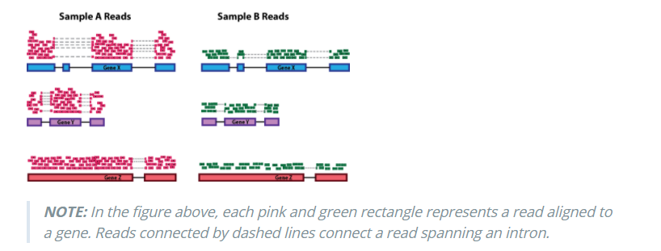
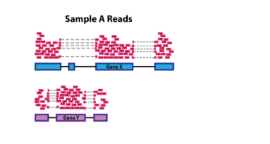
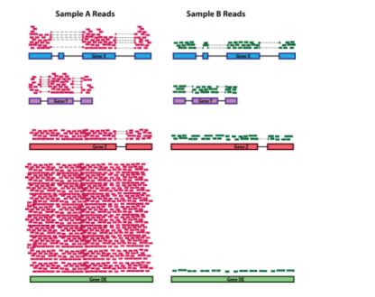

```{r setup, include=FALSE}
knitr::opts_chunk$set(echo = FALSE)
library(ggthemr)
uos_pal <- function(){
  uos_pal <- c("Process_Cyan"=rgb(0,159,218,maxColorValue = 255),
               "Pantone_274"=rgb(31,20,93,maxColorValue = 255),
               "Process_Yellow"=rgb(249,227,0,maxColorValue = 255),
               
               "Pantone_347"=rgb(0,155,72,maxColorValue = 255),
               "Pantone_382"=rgb(190,214,0,maxColorValue = 255),
               "Process_Magenta"=rgb(209,0,116,maxColorValue = 255),
               "Pantone_Orange_021"=rgb(255,88,0,maxColorValue = 255),
               
               "Pantone_512"=rgb(119,33,111,maxColorValue = 255),
               "Pantone_485"=rgb(213,43,30,maxColorValue = 255),
               "Pantone_Black"=rgb(30,30,30,maxColorValue = 255),
               "Pantone_161"=rgb(98,60,27,maxColorValue = 255),
               
               "Pantone_7501"=rgb(219,206,172,maxColorValue = 255),
               "Pantone_343"=rgb(3,86,66,maxColorValue = 255),
               "Pantone_322"=rgb(0,116,122,maxColorValue = 255),
               "Pantone_202"=rgb(130,36,51,maxColorValue = 255)
  )
  
  uos_pal
}

uos_colours <- as.character(uos_pal())
# you have to add a colour at the start of your palette for outlining boxes, we'll use a grey:
uos_colours <- c("#555555", uos_colours)
# remove previous effects:

ggthemr_reset()
# Define colours for your figures with define_palette
uos <- define_palette(
  swatch = uos_colours, # colours for plotting points and bars
  gradient = c(lower = uos_colours[1L], upper = uos_colours[2L]), #upper and lower colours for continuous colours
  background = "white" #defining a grey-ish background 
)
# set the theme for your figures:
ggthemr(uos)
suppressPackageStartupMessages(library(dplyr))
suppressPackageStartupMessages(library(ggplot2))
suppressPackageStartupMessages(library(DESeq2))
dds <- makeExampleDESeqDataSet()
```

## Week 3 recap

- first glimpse of our RNA-seq dataset
- used QA tools to un-cover sample swaps and annotation issues


## Week 4 overview

- use `DESeq2` to assess differential expression between groups of interest


## Data Transformation

- previously we transformed the data so we could visualise
- there are a further set of considerations to take into account for differential expression
- we obtain raw counts for each gene, but these are relative counts
- the relationship between counts and RNA-expression is not the same for all genes across all samples

## Depth



Differing sequencing depth
(image from Harvard Chan Bioinformatics Core)

## Gene Length



Longer genes likely to be sequenced more
(image from Harvard Chan Bioinformatics Core)

## Library composition



Highly-expressed genes overrepresented at the cost of lowly expressed genes
(image from Harvard Chan Bioinformatics Core)

## "Median Ratio" Normalisation

- create a "reference" sample that comprises the average counts for each gene
- for a given sample, divide each gene by the average counts
  + then for each sample take the median of these values
  + this is the *scale-factor*

## Statistical testing

- count-based data are not observed to be normally-distributed
- using a t-test as we did for microarrays would not be appropriate
- instead we use something called the *negative-binomial*
- this means we have to estimate the *dispersion* for each gene

## The DESeq pipeline

- DESeq2 provides a one-step method to carry out the required normalised and apply statistical tests
  + `DESeq(dds)`
  + we can run the steps manually if we wish..
- notice that the *raw counts* are used (not the input to PCA)
- the comparisons performed are determined by the `design`


## Design specification

- R's `~` notation is used to define the *design* of the experiment
- for simple cases `~condition` means compare conditions in our dataset
  + `condition` has to be a column in our *meta data*

```{r ,include=TRUE,message=FALSE,warning=FALSE}
design(dds)
colData(dds)
```


## Printing results

- results are in a familiar format; one row for each gene
- adjusted p-values are automatically calculated
- can use familiar `dplyr` functions to manipulate
  + `filter`, `arrange` etc
- pay attention to the contrast that is calculated at the *baseline*

```{r message=FALSE,warning=FALSE}
de <- DESeq(dds)
results(de)[1:3,]
```

## Column meanings

- `baseMean`; average count for the gene
- `log2FoldChange`; expression difference between sample groups on log$_2$ scale. i.e. 1 = 2$^1$ = 2, 1.5 = 2$^{1.5}$  $~$2.82
- (`lfcSE`; variability of the log fold change estimate)
- (`stat`; the test statistic)
- `pvalue`; the p-value - probability of obtaining the observed log fold-change due to chance alone
- `padj`; the p-value after multiple testing adjustment (BH)

## Other considerations

- can apply differential expression to a subset of the data
- can adjust the model to account for batch effects and other confounding factors
  + `~ batch + condition`
  
## Further Viewing

- [Differential expression analysis](https://youtu.be/5tGCBW3_0IA) - 26 minutes
- https://hbctraining.github.io/DGE_workshop/lessons/02_DGE_count_normalization.html