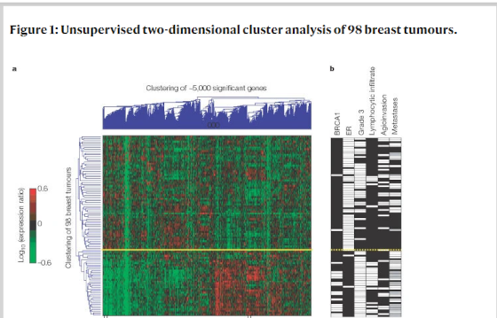

```{r setup, include=FALSE}
knitr::opts_chunk$set(echo = FALSE)
library(ggthemr)
uos_pal <- function(){
  uos_pal <- c("Process_Cyan"=rgb(0,159,218,maxColorValue = 255),
               "Pantone_274"=rgb(31,20,93,maxColorValue = 255),
               "Process_Yellow"=rgb(249,227,0,maxColorValue = 255),
               
               "Pantone_347"=rgb(0,155,72,maxColorValue = 255),
               "Pantone_382"=rgb(190,214,0,maxColorValue = 255),
               "Process_Magenta"=rgb(209,0,116,maxColorValue = 255),
               "Pantone_Orange_021"=rgb(255,88,0,maxColorValue = 255),
               
               "Pantone_512"=rgb(119,33,111,maxColorValue = 255),
               "Pantone_485"=rgb(213,43,30,maxColorValue = 255),
               "Pantone_Black"=rgb(30,30,30,maxColorValue = 255),
               "Pantone_161"=rgb(98,60,27,maxColorValue = 255),
               
               "Pantone_7501"=rgb(219,206,172,maxColorValue = 255),
               "Pantone_343"=rgb(3,86,66,maxColorValue = 255),
               "Pantone_322"=rgb(0,116,122,maxColorValue = 255),
               "Pantone_202"=rgb(130,36,51,maxColorValue = 255)
  )
  
  uos_pal
}

uos_colours <- as.character(uos_pal())
# you have to add a colour at the start of your palette for outlining boxes, we'll use a grey:
uos_colours <- c("#555555", uos_colours)
# remove previous effects:

ggthemr_reset()
# Define colours for your figures with define_palette
uos <- define_palette(
  swatch = uos_colours, # colours for plotting points and bars
  gradient = c(lower = uos_colours[1L], upper = uos_colours[2L]), #upper and lower colours for continuous colours
  background = "white" #defining a grey-ish background 
)
# set the theme for your figures:
ggthemr(uos)
suppressPackageStartupMessages(library(dplyr))
suppressPackageStartupMessages(library(ggplot2))
suppressPackageStartupMessages(library(DESeq2))
suppressPackageStartupMessages(library(ggrepel))
dds <- makeExampleDESeqDataSet()
```

## Week 4 Recap

- normalisation considerations for RNA-seq
- the DESeq2 workflow
- generated a table of potentially-interesting results

## Week 5 Overview

- using annotation databases to help interpret results
- common visualisations for RNA-seq
  + heatmap
  + volcano plot
- customisation of plots

## Annotation

- we often have not very descriptive names in our results table
  + `ENSMG00....`
  + these names are assigned by the resource that defined the transcripts
  + they do not make the results very easy to navigate
- we probably want to include more-common gene names and other genomic information in our tables and plots
- lots of online resources to do this, but not really in the spirit of the course

## Bioconductor resources

- the Bioconductor project provide a number of annotation resources that can help with this task
  + `org.Mm.eg.db`, `org.Hs.eg.db`,...
- they are installed in the usual way with `BiocManager::install`
- downloads a database that can be queried through RStudio
- an alternative is to use the biomart website via the `biomaRt` package

## columns and keys

- given a set of "*keys*" (genes of interest) we want to retrieve a series of *columns* from the database
  + think of the database as one big table
- need to specify what kind of identifier our keys are (e.g. Ensembl ID)
- need to specify the columns we want


## Joining tables

- the table obtained from Bioconductor can be *joined* with your results
  + need to have a column in common (may need to rename one of the tables)


## Individual gene plots - sanity checks

- choose your top gene and plot individual sample measurements
- or pick a gene that you know to be up- or down-regulated
- basic plot supported by `DESeq2`, but can be modified using `ggplot2`

```{r,include=TRUE,message=FALSE,warning=FALSE,fig.height=4}
dds <- DESeq2::makeExampleDESeqDataSet()
de <- DESeq(dds)
top_gene <- results(de) %>% data.frame %>% 
  arrange(padj) %>% 
  tibble::rownames_to_column("Gene") %>% 
  dplyr::slice(1) %>% 
    pull(Gene)
plotCounts(dds, top_gene,main = "My Top Gene")
```

## Volcano plot

- displays significance of result against the magnitude
- can label particular genes of interest

```{r include=TRUE,message=FALSE,warning=FALSE,fig.height=4}
results(de) %>% data.frame %>% 
  tibble::rownames_to_column("Gene") %>% 
  mutate(Label = ifelse(padj < 0.3, Gene, "")) %>% 
  ggplot(aes(x = log2FoldChange, y = -log10(padj),label=Label)) + geom_point() + geom_text_repel()
```

## Heatmaps

- hugely popular visualisation and also highly customisable
- example Van't veer et al (2002)



## Heatmaps

- visualise relationships between samples and genes
- a tree-like diagram (dendrogram) shows the relationship between samples and genes
  + derived in an un-supervised way
- can label known sample groups afterwards
- each cell in the plot is coloured according to expression level
  + **please don't use red and green!**
- actually not that hard to create (one function required), but may take time to create the input data
  
## Clustering (in brief)
  
- *distances* are calculated for each combination of samples. i.e. smaller distance meaning samples are similar
- a clustering algorithm the constructs a tree be repeatedly joining samples that are most similar
- the height on the y-axis is used to interpret how similar any two samples are
- however...

## Clustering (in brief)

- the x-axis is somewhat *arbitrary*
- so two samples being adjacent on the x-axis does not imply they are similar
- clustering can never not work


  
## Which genes to include?

- it would be impractical to create the heatmap from *all* genes
  + indeed R would run out of memory
  + and besides, most genes will not be changing or even expressed
- so we can choose an interesting subset 
  + e.g. most differentially expressed genes
  + genes from a particular pathway

## Heatmap procedure

- decide on interesting genes to use and get their IDs
- create a *subset* count matrix
  + use the variance-stablised counts
  + the IDs must match the rows of the counts
- use the `pheatmap` function from the `pheatmap` package
- customise as required
- export as pdf, png, TIFF if required

## Heatmap results

```{r include=TRUE,message=FALSE,warning=FALSE,fig.height=6}
top_genes <- results(de) %>% data.frame %>% 
  arrange(padj) %>% 
  tibble::rownames_to_column("Gene") %>% 
  arrange(padj) %>% 
  dplyr::slice(1:15) %>% 
    pull(Gene)
vsd <- varianceStabilizingTransformation(dds)
pheatmap::pheatmap(assay(vsd)[top_genes,],scale = "row")
```

## Further Viewing

- [Drawing and Interpreting Heatmaps](https://youtu.be/oMtDyOn2TCc) - 16 minutes
- [Useful plots and bad plots](https://youtu.be/46-t2jOYsyY) - 17 minutes
