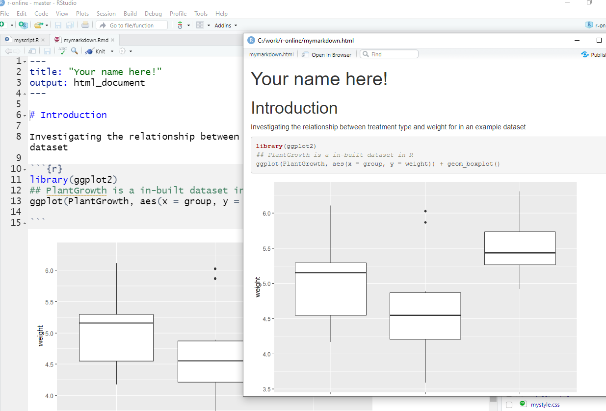

# Reproducible research in Rstudio

In this workshop we review the various ways of writing and running R code within RStudio and discuss their implications for reproducible research. There will also be an opportunity to review concepts in `dplyr` and `ggplot2`.

## The R console

The most primitive way of running commands in RStudio is using the *R console*. This appears in the lower-left panel of the default RStudio layout. Each command is typed separately and the results are displayed directly underneath. 


A record of each command is kept in the History panel (top-right), and previous commands can be cycled through using the up cursor key in the console window.

We would tend to use the R console for typing commands that we don't necessarily need to keep a record of. e.g. installing packages.

If you need to run analyses that require a lot of memory you will probably require access to a high-performance computing environment; such as sharc or bessemer at UoS. Analysis on such environments is performed via a terminal without a graphical interface. Although this means you won' have access RStudio, you can still run commands via the R console. You can also write R *scripts* to perform your analysis.

## An R script

A new R script can be created via the menus in RStudio. The script is a text file existing on your hard drive and can be used to document your analysis. In the screenshot below, an R script `myscript.R` was created to perform a few basic commands and make a plot from an in-built dataset in R.


There is a limited ability to add explanations and commentary to the file via the use of comments; e.g. lines 3 and 5 in the screenshot that have a `#` at the start of the line. Rstudio formats the text for the comments in green.

```{r}
## this is a comment
## everything on this line is ignored
```


The output of each line of code appears in the console, and any plots generated appear in the bottom-right panel. It is a step in the right direction, but far from a report that we can distribute to our peers. In order to make a report we would have to (manually) export the plots from RStudio and copy into another document or presentation. If the underlying data change, this becomes problematic; as illustrated in the following video

<div class="information">
[A non reproducible workflow](https://youtu.be/s3JldKoA0zw) - 2 minutes
</div>


## An R markdown file

An R markdown file solves the problem described above whereby plots, tables and statistics generated during the course of the analysis have to be manually copied into a report document. This process lends itself to errors and uncertainty over whether the latest version of the data are being used in the analysis.

You can think of the R markdown as a template used to create a report; which can be in Word, PDF or HTML formats. Creating a PDF will require you to have the *latex* typesetting program installed ([MikTeX](https://miktex.org/) on Windows). The language used to create the report is *markdown* which is a popular typesetting language. 

The report should encapsulate all the steps required to perform the analysis from an empty RStudio session. That is, you will need to specify the R packages that are used are how the raw data were imported; imagine you are trying to describe to a colleague how you performed the analysis and they have opened RStudio for the first time.

The screenshot below shows an example markdown file to analyse the `PlantGrowth` dataset, which is a dataset available through R.


Lines 1 - 4 are "header" information that is used to give a title for your report and specify what format the report will be generated in.

Line 6 is an example of the text formatting that is possible in markdown. Here "Introduction" will appear as a level 1 heading in the final report. Don't confuse the use of `#` with a code comment.

Lines 10 to 15 are an **R code chunk**. Lines 10 and 15 show where the "chunk" begins and ends, and anything in-between will be interpreted as R code. The code can be run by either highlighting particular lines and pressing CTRL+Enter, or hitting the green play button in the top-right of the chunk. The results appear directly underneath.

The start of the code chunk loads all the libraries that are required; in this case just `ggplot2`. We are using an *in-built* dataset, but typically we would need to include the code to read a file (e.g. `read_csv(....)`). Comments can also be included using `#` and these will be displayed in the code chunk that is rendered on the report.

At any point you can see what your report will look like by pressing the **Knit** button. At this point all the R code in the document is run in sequence. Provided there are no errors in your code, a pop-up window should appear. It advisable to knit the report early and often.



The example here is short and only consists of a single code chunk. If we wanted to add more steps (perhaps perform some statistical analysis), it would be better to create further code chunks rather than making the existing code chunk longer. Smaller, specific code chunks are easier to debug and improved readability.

We will typically use Markdown to create report documents, but in fact the same format can be used to generate a wide range of outputs; including web pages (the web pages for this course were all generated in R markdown), and presentations.

## An R notebook

An R notebook is a variation of the R markdown file and similar in most respects. The key difference is how the report is generated. With an R markdown file all the code has to be run in order to generate the report. However with an R notebook it merely displays the output of the code that you have run to date. You can use the Run menu option in RStudio to control which code chunks are run.

## Markdown formating and Chunk options

Anything inside an R code chunk is executed as R code, whereas anything outside is rendered as text. However, rather than plain boring text we can add all manner of formatting options to add emphasis such as *italics* or **bold** by adding `*` or `**` around the text. We can also add weblinks, images and lists. A quick summary is available through the RStudio Help menu. Section headings can be added to help with navigation. Different heading levels are created using the `#` symbol; **not to be confused with the use of `#` within code chunks to add comments**.

<div class="information">
Help -> Markdown Quick Reference
</div>

We can also controls aspects of how the R code is executed and displayed in the final report. This is achieved by adding extra options to the first line of the code chunk; the one with the `{r}`. Multiple options can be used by putting a `,` in between each one. 

Chunks can be named, which can help with navigation in RStudio and debugging.

- `{r dataImport}`
- `{r loadLibraries}`

### eval 

`{r eval=FALSE}`

We might not actually want to run the code inside the chunk, which we can do by specifying `eval=FALSE`. The effect on the final report is that the code is displayed but not evaluated (run). For example, you might want to remind you reader of the code to install a particular package, but not actually run that code every time the report is generated.

Or you might want to show the code you have used to import a large file from disk, but not have the code executed each time.

### echo

`{r echo=FALSE}`

The opposite is `echo` which runs a chunk of code, but doesn't print the code itself. For example you might to setup some parameters or load some pre-processed files from disk to save time (e.g. with `readRDS`).

### `warning` and `message`

`{r warning=FALSE, message=FALSE}`

This stops any warnings or messages from being printed to the report. These can occur when a package is loaded, but might not be of interest to people reading the report

## In-line R code

When writing a commentary to accompany your analysis you might have to refer to specific results you have calculated. e.g. for RNA-seq the p-values or fold-changes of particular genes of interest. Rather than having to manually type the values each time (which can change if we tweak our parameters), we can insert R code within our text to retrieve the value of a particular variable.


```{r}
## for demonstration only.
p <- 0.05
fc <- 2.35
```


```{r, echo = F}
p <- "`r p`"
fc <- "`r fc`"

```

Using a single *backtick* allows R code to be evaluated. Here we print the values of `p` and `fc` from our environment.

```
the p-value for Gene X is `r p` with a fold-change of `r fc`
```
```{r, echo = F}
p <- 0.05
fc <- 2.35
```

So if the value of `p` and `fc` change the text would automatically update.

This would be rendered in the final report as:-

> the p-value for Gene X  is `r p` with a fold-change of `r fc`

## "Global" chunk options

You will sometimes see the following code chunk at the top of a markdown / notebook file.

```{r}
knitr::opts_chunk$set(echo = TRUE)
```

This is an instruction to set the options for all code chunks in the document. It saves having to specify `echo = TRUE` manually in this case. Individual chunks can override this behaviour by using `echo = FALSE`.

### Exercise

In this exercise we will practice reading a file into R and performing some manipulation and plotting. We will use the *gapminder* dataset that you should already be familiar with. This should also allow us to review `dplyr` and `ggplot2` packages

- you can download a fresh copy of the gapminder dataset [from here](https://github.com/sheffield-bioinformatics-core/r-online/raw/master/raw_data/gapminder.csv)
- you will probably want to refer to the R coding primer [here](https://sbc.shef.ac.uk/bms397/)
- Ask the demonstrators if you have any problems!

Include the following in your analysis:-


<div class="exercise">

- A code chunk that shows how the packages, `readr`, `dplyr` and `ggplot2` can be installed - but do not evaluate the code
- A code chunk to import the gapminder csv file into RStudio
- `filter` the dataset to just the *European* countries
- write the European data to a file
- calculate the correlation between life expectancy and year for each country and present a table with countries in order of decreasing correlation
- make an appropriate plot to show the correlation values for each country
  + do not print the code to create the plot in the report
- Write a sentence to report how many countries have a correlation value less than 0.9.

</div>

You should now have both a R notebook (markdown) file that is a record of how you performed the analysis and a HTML file that can distributed to collaborators.

### Exercise

<div class="exercise">

Once you have created your notebook file, create a copy and modify it to perform the same analysis for the *African* countries.
</div>

# The role of Bioconductor in reproducible research

The bioconductor project has been instrumental in distributing software for the analysis of high-throughput biological data since the early 2000s. The initial set of packages were focused on the analysis of microarray data, but the set of packages has expanded to include sequencing data of various forms along with proteomics, flow cytometry and image analysis. Packages in Bioconductor are generally of high-quality as researchers have to pass a number of rigorous set of test before the software can be distributed. 

The documentation standards are also higher than other R repositories. Each package is required to have a user guide (or vignette) that describes in detail how to perform analyses with the package and present several use cases.

### Exercise

<div class="exercise">
- Go to the Bioconductor website and navigate to the list of software packages. How many packages are available for the analysis of RNA-seq data? What are the top five most popular packages?
- Who is the maintainer of the `DESeq2` package? What is the latest version and when was the *user guide* last updated?
- Back on the software packages page, how many *workflows* are available for GeneExpression?
- How many example RNA-seq datasets are available via the *ExperimentData* section?

</div>

# Summary

- R markdown notebooks can facilitate reproducible research
- Reports created from an R notebook can be shared with our peers who can see the code we used and run for themselves.
- The Bioconductor project distributes software, workflows, annotation and example datasets
- Help on a particular package can be obtained via it's user guide, or from the support forum.

# Exercise for next time

<div class="exercise">
Install the following set of packages that are available through Bioconductor.

- `DESeq2`, `pheatmap`, `org.Mm.eg.db`. `genefilter`, `GEOquery`, `GenomicFeatures`, `tximport`, `limma`, `biomaRt`, `clusterProfiler`, `pathview`, `fgsea`, 
- Download the dataset required for the course from [this link](bms353.zip). Un-zip the file and create an RStudio project corresponding to the extracted data.
- Download the example gapminder analysis from the course website (to be made available after the lab session). Evaluate how well you feel you answered the in-lab exercise.
</div>